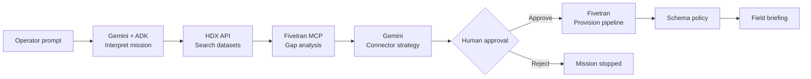

# OpenAid Provisioner

**Turn chaotic humanitarian data requests into governed Fivetran pipelines — with human approval on every write.**

Built for the [Google Cloud Rapid Agent Hackathon](https://rapid-agent.devpost.com/) — **Fivetran track**.

[](LICENSE)
[](https://rapid-agent.devpost.com/)
[](https://cloud.google.com/vertex-ai)
[](https://github.com/fivetran/fivetran-mcp)

---

## The problem

When a crisis hits — floods in Kenya, an earthquake, a refugee surge — aid teams need data **now**. Medical supply locations, shelter capacity, food distribution points. The data often exists on [HDX](https://data.humdata.org/) (the UN humanitarian data exchange), but getting it into an analyst-ready warehouse takes days:

- Operators must **find** the right dataset among thousands on HDX
- Engineers must **build** a custom connector or manual ETL
- Data teams must **configure** Fivetran connections, schema policies, and sync schedules
- Field coordinators wait with **empty dashboards** while bureaucracy catches up

**The gap:** Humanitarian workers speak in missions (*"we need medical supply data for flooded regions in Kenya"*), but data infrastructure speaks in connectors, schemas, and sync frequencies. Nobody should need to be a data engineer during an emergency.

---

## Our solution

**OpenAid Provisioner** is an AI agent that closes that gap. An operator describes what they need in plain language. The agent:

1. **Understands** the mission (region, data type, urgency) using Gemini on Vertex AI
2. **Discovers** matching datasets on HDX via live API search
3. **Analyzes** existing Fivetran connections for coverage gaps
4. **Plans** the right connector strategy (Connector SDK for HDX CSV/JSON)
5. **Pauses** for human approval before any infrastructure change
6. **Provisions** the pipeline via Fivetran (MCP + REST)
7. **Delivers** a field briefing for coordinators on the ground

Human oversight is built in — the agent proposes; the operator approves.

---

## How the agent works



### 8-step mission pipeline

| Step | Tool | What happens |
|------|------|--------------|
| 1. Interpret | `gemini.reason` | Gemini parses intent, region, HDX search query |
| 2. Discover | `hdx.search` | Live CKAN search on data.humdata.org |
| 3. Gap analysis | `fivetran.mcp.list_connections` | Check if data is already synced |
| 4. Strategy | `fivetran.mcp.list_metadata_connectors` | Pick Connector SDK + table plan |
| 5. Approval | `human.approval` | Operator reviews plan in UI — **required** |
| 6. Provision | `fivetran.create_connection` | Create paused Fivetran connection |
| 7. Schema policy | `fivetran.modify_connection_schema_config` | Set `ALLOW_COLUMNS` handling |
| 8. Briefing | `bigquery.briefing` | Generate coordinator summary |

Steps stream live to the dashboard via Server-Sent Events (SSE).

---

## Architecture

```
┌─────────────────────────────────────────────────────────────┐
│  Next.js Dashboard (operator UI + approval gate)            │
└──────────────────────────┬──────────────────────────────────┘
                           │ SSE / REST
┌──────────────────────────▼──────────────────────────────────┐
│  FastAPI Orchestrator (8-step mission, approval gate)       │
│  ├── Gemini + Google ADK (Vertex AI) — reasoning            │
│  ├── HDX CKAN API — dataset discovery                       │
│  └── Fivetran Gateway — MCP stdio → REST fallback           │
└──────────────────────────┬──────────────────────────────────┘
                           │
         ┌─────────────────┼─────────────────┐
         ▼                 ▼                 ▼
   Vertex AI          data.humdata.org    Fivetran MCP
   (Gemini 2.5)       (HDX search)       (partner server)
                                              │
                                              ▼
                                    Connector SDK (Python)
                                    HDX CSV/JSON → BigQuery
```

| Layer | Technology | Role |
|-------|------------|------|
| Brain | **Gemini 2.5 Flash** via **Google ADK** on **Vertex AI** | Mission interpretation, connector strategy |
| Superpower | **Fivetran MCP** ([fivetran/fivetran-mcp](https://github.com/fivetran/fivetran-mcp)) | List connections, metadata, provision pipelines |
| Discovery | **HDX CKAN API** | Live humanitarian dataset search |
| Custom ingest | **Fivetran Connector SDK** | Pull HDX CSV/JSON into warehouse |
| Destination | **BigQuery** (via Fivetran) | Analyst-ready tables |
| Orchestration | **FastAPI + SSE** | Multi-step agent with streaming |
| UX | **Next.js** | Operator dashboard with approval UI |

---

## Impact

| Stakeholder | Before OpenAid | With OpenAid |
|-------------|----------------|--------------|
| **Field coordinator** | Waits days for data team | Describes need in one sentence, gets briefing in minutes |
| **Data engineer** | Manual HDX search + connector build | Agent drafts plan; engineer approves and ships |
| **Aid organization** | Siloed spreadsheets per crisis | Governed, repeatable Fivetran pipelines to BigQuery |
| **Humanitarian sector** | Reactive data scrambling | Proactive, auditable data provisioning |

**Real-world scenario:** *"We need medical supply data for flooded regions in Kenya — our dashboard is empty."*

The agent finds HDX health datasets, detects no existing Fivetran coverage, proposes a Connector SDK pipeline, waits for approval, and delivers a field briefing — turning a multi-day workflow into a governed, minutes-long process.

---

## Hackathon alignment

| [Judging criteria](https://rapid-agent.devpost.com/) | How we address it |
|----------------------|-------------------|
| **Technological implementation** | Vertex AI + ADK, Fivetran partner MCP, live HDX API, Connector SDK, SSE orchestration |
| **Design** | Clean operator dashboard, streaming steps, explicit approval gate |
| **Potential impact** | Humanitarian data access during crises — floods, conflicts, epidemics |
| **Quality of the idea** | Bridges natural-language missions and governed data infrastructure |

| [Hackathon requirement](https://rapid-agent.devpost.com/) | Status |
|-----------------------------------------------------------|--------|
| Functional agent (not just chat) | 8-step tool-using pipeline |
| Multi-step mission with planning | Orchestrator plans and executes sequentially |
| Partner MCP integration | Fivetran MCP via ADK `MCPSessionManager` + REST fallback |
| Gemini + Google Cloud Agent Builder | Gemini on Vertex AI via Google ADK |
| Human oversight | Approval gate before Fivetran writes |
| Public repo + open source license | MIT — [github.com/Krixna-Kant/OpenAID](https://github.com/Krixna-Kant/OpenAID) |

---

## Demo

### Try it locally

**Prompt:**
> We need the latest medical supply data for flooded regions in Kenya, but our dashboard is empty.

**What you'll see:**
1. Agent interprets mission → region: Kenya, intent: provision pipeline
2. HDX search returns matching datasets with CSV/JSON resources
3. Fivetran gap analysis shows existing connection coverage
4. Connector strategy recommends Connector SDK for HDX source
5. **Approval card** appears — review the plan, then Approve or Reject
6. Pipeline provisioned (simulated in demo mode)
7. Field briefing generated for coordinators

### Demo vs live mode

| Setting | Demo (default) | Live |
|---------|----------------|------|
| `DEMO_MODE` | `true` | `false` |
| `FIVETRAN_ALLOW_WRITES` | `false` | `true` |
| Fivetran provision | Simulated | Real MCP/API calls |
| HDX search | Real API | Real API |
| Gemini reasoning | Vertex AI (GCP) | Vertex AI or API key fallback |
| BigQuery briefing | Template text | Live query (Phase 4) |

---

## Quick start

### Prerequisites

- Python 3.11+
- Node.js 20+
- [GCP free trial](https://cloud.google.com/free) + Vertex AI — [setup guide](docs/GCP_FREE_TRIAL_SETUP.md)
- [Fivetran trial](https://fivetran.com/) (14 days) — [setup guide](docs/FIVETRAN_MCP_SETUP.md)
- [uv](https://docs.astral.sh/uv/) for Fivetran MCP (`uvx`)

### 1. Clone and configure

```bash
git clone https://github.com/Krixna-Kant/OpenAID.git
cd OpenAID

# Backend
cd backend
python -m venv .venv
.venv\Scripts\activate        # Windows
pip install -r requirements.txt
cp .env.example .env          # Edit with your credentials
python scripts/verify_gcp.py
uvicorn app.main:app --reload --port 8000

# Frontend (new terminal)
cd frontend
npm install
cp .env.local.example .env.local
npm run dev
```

Open **http://localhost:3000** — backend health at **http://localhost:8000/health**

### 2. Connector SDK (optional — local test)

```bash
cd connector-sdk
python -m venv .venv
.venv\Scripts\activate
pip install -r requirements.txt
cp configuration.json.example configuration.json
fivetran debug --configuration configuration.json
```

### 3. Verify integrations

```bash
cd backend
.venv\Scripts\activate
python scripts/verify_gcp.py          # Vertex AI + Gemini
python scripts/verify_fivetran_mcp.py # Fivetran MCP + REST
```

---

## Environment variables

| Variable | Required | Description |
|----------|----------|-------------|
| `GOOGLE_CLOUD_PROJECT` | Yes | GCP project ID |
| `USE_VERTEX_AI` | Yes | `true` for Vertex AI (recommended) |
| `GOOGLE_CLOUD_LOCATION` | No | Default `us-central1` |
| `GEMINI_MODEL` | No | Default `gemini-2.5-flash` |
| `FIVETRAN_API_KEY` | Phase 2+ | Fivetran API key |
| `FIVETRAN_API_SECRET` | Phase 2+ | Fivetran API secret |
| `FIVETRAN_GROUP_ID` | Phase 2+ | Destination group ID |
| `FIVETRAN_ALLOW_WRITES` | No | `true` for live provisioning (default `false`) |
| `BIGQUERY_PROJECT` | Phase 4 | GCP project for briefings |
| `BIGQUERY_DATASET` | Phase 4 | Dataset with synced tables |
| `DEMO_MODE` | No | `true` simulates Fivetran writes (default) |

See `backend/.env.example` for the full list.

---

## Project structure

```
OpenAID/
├── backend/
│   ├── app/
│   │   ├── agents/
│   │   │   ├── orchestrator.py      # 8-step mission + approval gate
│   │   │   ├── adk_agent.py         # Google ADK LlmAgent
│   │   │   └── fivetran_adk_tools.py # ADK McpToolset
│   │   ├── tools/
│   │   │   ├── gemini_reason.py     # Mission interpretation + strategy
│   │   │   ├── hdx_search.py        # Live HDX CKAN API
│   │   │   ├── fivetran_gateway.py  # MCP → REST unified access
│   │   │   ├── fivetran_mcp_stdio.py # Fivetran partner MCP client
│   │   │   └── bigquery_briefing.py # Field briefing generation
│   │   ├── config.py
│   │   ├── capabilities.py
│   │   └── main.py                  # FastAPI + SSE
│   └── scripts/
│       ├── verify_gcp.py
│       └── verify_fivetran_mcp.py
├── frontend/                        # Next.js operator dashboard
├── connector-sdk/                   # Fivetran Connector SDK (HDX → warehouse)
├── docs/
│   ├── GCP_FREE_TRIAL_SETUP.md
│   └── FIVETRAN_MCP_SETUP.md
└── LICENSE
```

---

## Build status

| Phase | Focus | Status |
|-------|--------|--------|
| **0** | Foundation, config, scaffolds | Done |
| **1** | Gemini + ADK on Vertex AI | Done |
| **2** | Fivetran MCP stdio + REST fallback | Done |
| **3** | Full pipeline lifecycle (live provision) | In progress |
| **4** | BigQuery field briefing (live queries) | Planned |
| **5** | Cloud Run + Vercel deployment | Planned |
| **6** | Demo video + Devpost submission | In progress |

---

## Future improvements

- **Live BigQuery briefings** — query synced tables for real row counts, freshness, and coverage stats
- **Autonomous ADK agent loop** — full ADK agent driving all steps (today: orchestrator + ADK for reasoning)
- **Multi-source missions** — provision several HDX datasets in one approval batch
- **Schema drift alerts** — notify operators when HDX publishers change column layouts
- **Cloud Run deployment** — hosted demo URL for judges
- **Fivetran MCP hardening** — resolve `schema_file` parameter for full MCP path (REST fallback works today)
- **Connector SDK auto-deploy** — agent deploys SDK connector with mission-specific `source_url` from HDX resource
- **Role-based access** — separate approver vs operator roles for large NGOs

---

## Team & submission

| | |
|---|---|
| **Hackathon** | [Google Cloud Rapid Agent Hackathon](https://rapid-agent.devpost.com/) |
| **Track** | Fivetran |
| **Repository** | [github.com/Krixna-Kant/OpenAID](https://github.com/Krixna-Kant/OpenAID) |
| **License** | [MIT](LICENSE) |

---

## License

MIT License — see [LICENSE](LICENSE).
